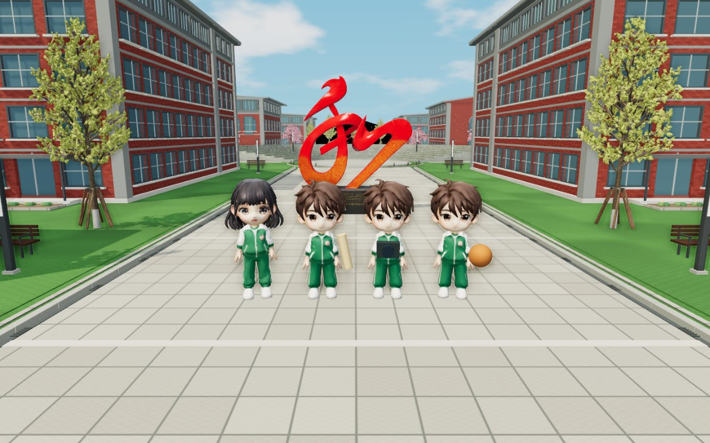
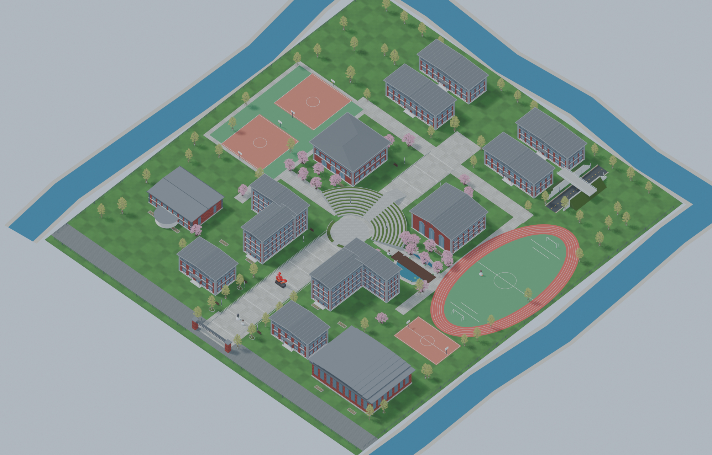

# 晴日校园 · 春日校园祭 V3

电脑浏览器里的 3D 校园探索游戏。与嘉豪、唐予、周屿找回被风吹散的策划页，体验投篮、拍下合影，一起筹备春日校园祭。



## 在线试玩

**[点击进入游戏](https://haojy888.github.io/haojycampus/)**，无需下载或登录 GitHub。推荐使用电脑 Chrome / Edge，首次打开需要加载模型。

## 启动

需要安装 Node.js，推荐在开启硬件加速的 Chrome / Edge 中游玩。所有运行依赖、模型和贴图已包含在仓库中，无需 npm 安装或构建。

```sh
git clone https://github.com/Haojy888/haojycampus.git
cd haojycampus
node server.mjs
```

打开 **http://127.0.0.1:8848/**。Windows 也可双击 `Start-Game.cmd` 自动打开浏览器。请通过本地服务打开游戏，直接双击 HTML 无法加载模块和模型。

## 操作与玩法

| 操作 | 按键 |
| --- | --- |
| 移动 / 奔跑 | WASD 或方向键 / Shift |
| 环顾 / 调整镜头 | 鼠标左键拖动 / 滚轮 |
| 对话、拾取、打卡 | E |
| 剧情手账 / 校园地图 | J / M |
| 暂停 | Esc |

五章主线：校门找嘉豪 → 找回三张策划页 → 三次节奏投篮 → 樱花合照 → 长廊餐厅筹备点决定开场方式并拍四人合影。三次投篮不要求全中；结尾有三种回应。完成后可以继续漫游、聊天、投篮并收集 8 枚地标印章。

进度与照片自动保存到当前浏览器；更换浏览器或清除站点数据后不会保留。画面卡顿时，可将右上角“细腻”切换为“流畅”。

## V3 场景



- 10 栋细化建筑：教学楼、图书馆、文昌会堂、宿舍、艺术楼与甲秀楼；保留体育馆及长廊餐厅。
- 9 层弧形看台、30 级中央台阶、墨池木桥、东北侧白色跨路桥。
- 63 棵春季行道树、23 棵樱花树、飘落花瓣、天空与水面波纹。
- 本地 Blender 建筑与场景，Aholo Lux3D 生成的角色、雕塑及树木。

## 文件结构

| 路径 | 内容 |
| --- | --- |
| `dist/index.html`、`dist/style.css` | 页面与界面 |
| `dist/game.js` | 移动、相机、碰撞、场景与地标 |
| `dist/story.js`、`dist/story_data.js` | 剧情、对话、投篮、拍照与存档 |
| `dist/atmosphere.js` | 天空、水波、环境光、花瓣与画质 |
| `dist/assets/` | 8 个 GLB、布局与场景清单，贴图内嵌 |
| `dist/vendor/` | Three.js 0.180.0 与所需扩展 |
| `server.mjs`、`Start-Game.cmd` | 本地启动 |
| [QA.md](QA.md) | 试玩验证与当前限制 |

可将 `dist/` 整体作为静态站点根目录部署。游戏运行不需要 API 密钥；首次加载模型约 78 MB。仓库包含运行所需的优化资产。

## 来源与范围

校园外观参考[中央民大附中贵阳学校校园摄影文章](https://mp.weixin.qq.com/s/XEt3N4YjOpGvRhKeZaQfnQ)及提供的校园俯视图。地图为室外探索进行了比例压缩，不是测绘复原；建筑内部不可进入，暂不支持多人联机。角色采用简易身体绑定，没有表情、手指动画和脚部 IK。

Three.js 许可证见 [dist/vendor/LICENSE](dist/vendor/LICENSE)。
