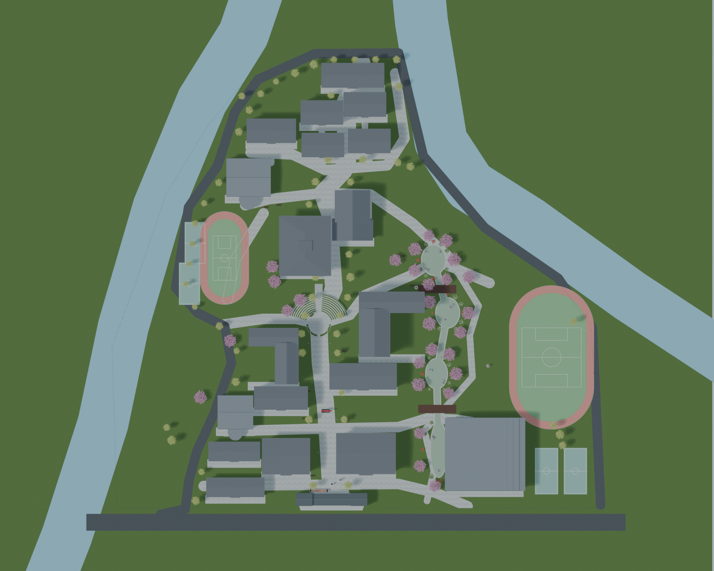

# 晴日校园 · 春日校园祭 V4

电脑浏览器里的 3D 校园探索游戏。和嘉豪、唐予、周屿找回策划页、体验投篮、拍下合影，一起筹备春日校园祭。

**[点击在线试玩](https://haojy888.github.io/haojycampus/)**。无需下载或登录 GitHub；推荐电脑 Chrome / Edge，首次打开需要加载模型。


## 按校园俯视图重新排布

整体位置以用户确认的中央民族大学附属中学贵阳学校俯视图为依据；新搜索的实景照片用于校门、立面、屋顶与景观细节。



| 图中区域 | 本版场景 |
| --- | --- |
| 下方入口 | 红砖门房、灰瓦门廊、粉红校名石碑、准确中文金字 |
| 中央教学区 | 格物楼、致知楼与南翼，错落院落和阶梯剧场 |
| 上方 | 六栋宿舍、长廊餐厅、图书馆和文昌会堂 |
| 左侧 | 小体育场、球场、开敞草坪、二食堂与教师公寓 |
| 右侧 | 串联池塘的墨池水园、低木桥、石岸和花木 |
| 右下方 | 复兴体育场、其下方的体育馆与室外球场 |

19 栋建筑按俯视图重新定位；教学楼改为厚红砖墙、深窄窗和石墨灰竖肋，图书馆采用高竖窗与宽挑檐，会堂采用错高拱窗与双山墙。82 株树木与 42 组低层景观复用几何。新增樱花、校名石碑、池岸石灰岩由 Aholo Lux3D 生成，建筑、地面与整场景由 Blender 制作。


## 本地启动

运行依赖、模型和贴图均在仓库内，无需 npm 安装或构建。安装 Node.js 后：

```sh
git clone https://github.com/Haojy888/haojycampus.git
cd haojycampus
node server.mjs
```

打开 `http://127.0.0.1:8848/`；Windows 也可双击 `Start-Game.cmd`。直接双击 HTML 无法加载模块和模型。

## 操作与剧情

| 操作 | 按键 |
| --- | --- |
| 移动 / 奔跑 | WASD 或方向键 / Shift |
| 环顾 / 镜头远近 | 鼠标拖动 / 滚轮 |
| 对话、拾取、打卡 | E |
| 剧情手账 / 地图 | J / M |
| 暂停 | Esc |

五章：校门认识嘉豪 → 找回三张策划页 → 三次节奏投篮 → 樱花合照 → 长廊餐厅筹备与四人合影。投篮不要求全中，结尾有三种回应；完成后可以继续漫游、聊天、投篮、收集 8 枚地标印章。

旧版存档保留章节、纸页、成绩、印章和照片，第一次进入 V4 时回到新校门。进度保存在当前浏览器。画面卡顿可将右上角“细腻”切为“流畅”。

## 文件

- `dist/game.js`：移动、相机、碰撞和场景装配。
- `dist/story.js`、`story_data.js`：剧情、投篮、拍照和存档。
- `dist/assets/campus_layout_v4.json`：建筑碰撞、水域、桥、地标和俯视布局。
- `dist/assets/scenery_v4.json`：树木、花境、岩石和雕塑位置。
- `dist/assets/`：13 个运行用 GLB，贴图内嵌。
- `dist/vendor/`：Three.js 0.180.0；许可证在 `dist/vendor/LICENSE`。
- [QA.md](QA.md)：实测记录与范围。

游戏运行无需 API 密钥。`dist/` 可独立作为静态站点部署；仓库根入口适配 GitHub Pages。

## 参考与范围

新增实景来自[贵州师范学院的校园考察照片](https://www.gznc.edu.cn/info/1088/26146.htm)、[纳米材料实验室校门活动照片](https://nano.gznc.edu.cn/info/1047/1493.htm)，并结合用户提供的[校园摄影文章](https://mp.weixin.qq.com/s/XEt3N4YjOpGvRhKeZaQfnQ)。[完整来源及取舍说明](docs/campus-v4-references.md)只列链接和观察，没有转载实景照片。

本版按俯视图恢复相对位置；建筑尺寸、未拍到的背面及高差仍是照片推断，并非测绘模型。建筑内部暂不可进入，暂不支持多人联机；角色有 idle / walk，尚无表情、手指动画和脚部 IK。
